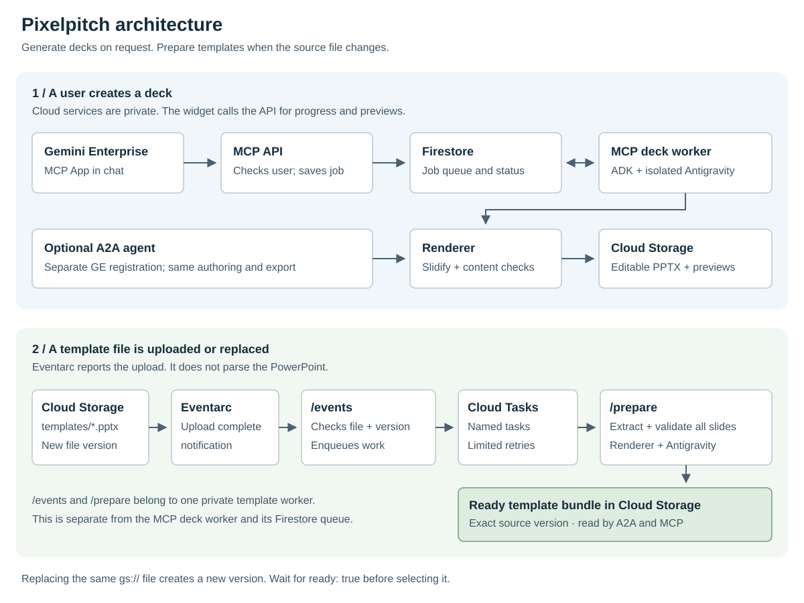

# Pixelpitch Slidegen

Create editable PowerPoint decks in Gemini Enterprise. Use an interactive MCP
App, an A2A agent with A2UI cards, or both. Both interfaces share slide authoring,
template preparation, and the PowerPoint renderer.

## Start here

| I want to… | Read |
|---|---|
| Set up the MCP App in my project | [MCP setup, step by step](docs/mcp-setup.md) |
| Deploy A2A, MCP, or both from Cloud Shell | [Cloud Shell deployment](CLOUD_SHELL.md) |
| Understand the services and data flow | [Architecture](docs/architecture.md) |
| Parse templates automatically when files change | [Template upload and recovery](docs/template-operations.md) |
| Develop the MCP widget locally | [MCP development](mcp-app/README.md) |
| Check template fidelity and export behavior | [Template architecture](docs/template-architecture.md) and [renderer](renderer/README.md) |

All setup values come from your configuration. No project ID, tenant, OAuth
client, or customer template is provided by this repository.



The [architecture explanation](docs/architecture.md) describes the diagram in text.

## Choose an interface

MCP opens an editable brief, saves a generation job, and shows slide drafts while
a separate worker continues. Available final previews come from the exported
PowerPoint. The downloaded `.pptx`, not the preview image, is the editable file.

A2A uses the native ADK agent and Gemini Enterprise's composite A2UI catalog.
Its standalone Cloud Run path streams generation within the request. Saved-job
A2A behavior currently belongs to the workstation experiment, not Cloud Run.

MCP has its own OAuth connector. Adding MCP does not require replacing an A2A
registration. Local browser tests do not prove that a particular Gemini
Enterprise tenant supports the widget. Complete the signed-in setup test.

## Prepare a checkout

This repository contains the agent, renderer, and Slidify converter. It does
not need the Pixelpitch desktop or web application, a parent checkout, or its
JavaScript workspace. See [what is included](docs/standalone-repository.md).

Install [mise](https://mise.jdx.dev/getting-started.html), review `mise.toml`, then run:

```bash
git clone https://github.com/vamsiramakrishnan/pixelpitch-slidegen.git
cd pixelpitch-slidegen
mise trust
mise install
mise run setup
```

`setup` installs the locked Python environments and checks the four slide skills.
It does not create cloud resources. ADK and Antigravity have separate Python
environments because their dependency versions conflict. Keep that separation.

Antigravity loads only deck orchestration, slide craft, brand derivation, and
template round-tripping skills. The broader skill catalog is not included.
Brand and style choices remain available as local data, without loading their
source skill documents into the worker's context.

Continue with the [MCP guide](docs/mcp-setup.md) or [Cloud Shell guide](CLOUD_SHELL.md).
Do not run a full deployment against existing resources that this checkout's
Terraform state does not own.

## Prepare templates when files change

With automatic preparation deployed, uploading or replacing a `.pptx` directly
under `templates/` triggers parsing. Eventarc delivers the upload notification.
Cloud Tasks queues the work. A private worker extracts every source slide and
saves a validated bundle for that exact file version.

Both A2A and MCP use that bundle. An old bundle is not silently used after the
source changes. Run `mise run templates-status` and wait for `ready: true`.
See [how template updates work](docs/template-architecture.md).

Template-based output preserves measured layout positions and source artwork.
It does not copy native PowerPoint masters or guarantee pixel-identical output.
The renderer checks for missing authored text and editability before publishing.

## Develop and verify

For a first local preview without cloud credentials, run:

```bash
mise run setup-dev
mise run demo
```

Open `http://127.0.0.1:18092`. This runs the real MCP widget, job queue,
draft previews, and cancellation with synthetic slides and placeholder
downloads. It does not generate a real PowerPoint or prove Gemini Enterprise
compatibility. The host labels the mode and lets you test narrow chat columns.

Run `mise run doctor` for local dependency checks and repair commands. After
changing the UI, run `mise run build-ui` and reload the browser. For real model
calls and export, configure `.env` and use `mise run dev` on port 18093.
See the [developer loop](docs/development.md) for the progression to a signed-in test.

Run these verification commands from this directory:

```bash
uv run pytest tests/unit tests/integration
mise run docs-check
```

For MCP browser tests, install UI dependencies and Chromium first:

```bash
cd mcp-app
npm ci
npx playwright install chromium
cd ..
mise run test-mcp
```

For local A2A experiments, use the [workstation guide](docs/workstation-preview.md).
Do not use a workstation relay as a customer production deployment.

## Repository map

| Directory | Owns |
|---|---|
| `app/` | ADK agent, A2A/A2UI, MCP API, job state, and shared template logic |
| `agy-worker/` | Isolated Antigravity authoring and four slide-generation skills |
| `mcp-app/` | Interactive widget, local host, and MCP image build |
| `renderer/` | Slidify conversion, source extraction, and export checks |
| `vendor/slidify/` | Local converter package, assets, and regression tests |
| `template-worker/` | Preparation image built from the renderer image |
| `deployment/terraform/` | Shared, MCP, and template infrastructure modules |
| `scripts/` | Setup, deployment, diagnostics, and verification |
| `docs/` | Setup guides, architecture, and operations |

## Before a public release

Follow the [public release checklist](docs/release-checklist.md). It covers the
documentation check, tracked generated files, credentials, history, licenses,
and clean-checkout verification. Passing the documentation check alone does
not make the full repository ready to publish.
