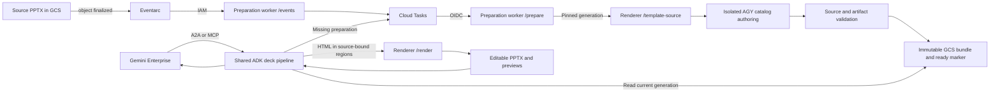

# Upload-triggered template preparation

Template parsing runs before the first deck request when automatic preparation
is deployed. Both A2A and MCP use the result. Neither conversation needs to own
the upload-triggered parsing job.

## In plain language

1. You upload or replace `templates/company.pptx` in your configured bucket.
2. Cloud Storage gives the file a new version number, called a generation.
3. Eventarc sends an upload-complete notification. It does not parse slides.
4. The template worker's `/events` endpoint checks the file and queues a Cloud Task.
5. Cloud Tasks calls `/prepare`. The worker extracts every slide, builds the
   layout catalog, and checks the prepared files.
6. The worker saves a ready bundle for that exact generation. Both interfaces
   can use it after `mise run templates-status` reports `ready: true`.

Replacing the same `gs://` URI starts preparation again. You do not need to
restart an agent or send a chat message. Metadata-only edits do not trigger
this pipeline. Files already in the bucket are handled by backfill.

See the [architecture SVG and explanation](architecture.md), or follow the
[upload and recovery steps](template-operations.md).

## Two paths share one validated template



`/events` and `/prepare` are endpoints on the same private `slidegen-template-worker` service. The first only enqueues work. The second performs preparation within a Cloud Tasks HTTP attempt. Conversation requests do not own the worker's lifetime.

The preparation image inherits the deployed renderer's exact image digest. It contains the same Slidify engine, Chromium, LibreOffice, and source fonts, plus separate ADK and AGY environments. Runtime package installation is not a prerequisite for the preparation playbook.

## A generation is the content identity

A storage object is identified by its bucket, name, and generation. Overwriting a `.pptx` creates a new generation even when its `gs://` URI stays unchanged. Eventarc's `google.cloud.storage.object.v1.finalized` event covers both creation and overwrite. Metadata-only changes do not require content parsing. [Cloud Storage trigger behavior](https://docs.cloud.google.com/eventarc/standard/docs/run/route-trigger-cloud-storage)

The receiver accepts only direct `.pptx` children of the configured source prefix, which defaults to `templates/`, in `SLIDEGEN_GCS_BUCKET`. It ignores PDFs, nested prepared artifacts, generated decks, and other buckets. Generated `prepared-templates/` and `template-jobs/` objects cannot create a preparation loop.

`TemplateVersion` defines the identity and storage paths in `app/template_versions.py`:

```text
templates/company.pptx                         user-owned source
prepared-templates/<source-id>/<generation>/
    <bundle-id>/manifest.json                  source identity and artifact hashes
    <bundle-id>/spec/...                       resolved source geometry and styles
    <bundle-id>/base/...                       every source slide rendered
    <bundle-id>/clean/...                      source artwork without slide text
    <bundle-id>/baselines/...                  compiled, source-positioned HTML
    <bundle-id>/catalog/...                    catalog preview images
    <bundle-id>/catalog.json
    ready.json                                selects one complete bundle
template-jobs/<task-id>.json                    attempt status and failure detail
decks/...                                      generated presentations
```

`source-id` hashes the full source URI, not a normalized display name. `task-id` hashes that URI and the generation. Different objects with similar filenames do not collide.

An attempt uploads immutable, hash-validated artifacts with a create-only GCS precondition. It writes the bundle manifest next and the generation's `ready.json` last. A crash before the ready marker leaves no usable partial bundle. A retry can reuse identical uploaded bytes. If duplicate attempts produce different valid bundles for the same generation, the first committed bundle wins.

There is no mutable cross-generation "latest" pointer. The shared deck pipeline looks up the live source generation, then its ready marker. A slow generation 12 job cannot overwrite generation 13's files or make generation 12 selectable as current. The worker skips an obsolete source before authoring and checks again before publication. Readers validate the actual source identity and artifact hashes before using the bundle.

The original ETag remains provenance, but a metadata-only ETag change does not invalidate a generation-addressed bundle. Legacy bundles keep their earlier ETag validation. Older `templates/<slug>/prepared/` bundles are a read-only compatibility fallback only when they pass source validation. Backfill creates the new generation-addressed bundles.

## The template is parsed, not inferred from a cover sample

The renderer downloads the requested generation with a GCS precondition. It resolves inherited typography, text-frame geometry, table cells, and source page fields. It renders every source slide, including body layouts near the end of the deck. It removes editable slide text in OOXML to make artwork plates rather than painting over rendered images.

The compiler creates fixed source-positioned HTML with declared editable regions. AGY derives the catalog and authors within those regions. It cannot replace the extracted source artifacts or compiled shells. The prepared manifest checks source coverage and hashes before publication.

Generated text and tables remain editable, while original artwork is retained in image plates. This is source-bound HTML reconstruction, not transplantation of native PowerPoint masters or a promise of pixel-identical output. The renderer separately rejects exports that lose authored text or fail editability admission.

The renderer's `full` profile measures visual similarity and OCR recall without applying Slidify's automatic raster corrections. A correction can turn editable text into an image even when the conversion reports successful editability. The independent authored-content check catches that loss. Visual discrepancies remain available in `quality.fidelity_failures` rather than triggering text-to-image replacement. See [Export quality](../renderer/README.md#export-quality) for the profile and local verification contract.

## Delivery, retries, and failures

Cloud Tasks uses a deterministic task name for normal delivery. Duplicate enqueue attempts receive `ALREADY_EXISTS` and are acknowledged without scheduling another task. Durable ready markers provide idempotency after Cloud Tasks' task-name retention window. [Cloud Tasks deduplication and HTTP tasks](https://docs.cloud.google.com/tasks/docs/create-tasks)

The queue dispatches at most one preparation attempt concurrently. It permits three attempts, with 60-to-300-second retry backoff. Each HTTP attempt has a 30-minute deadline; the worker's AGY call has a 25-minute operational limit. These limits apply to preparation, not to ordinary A2A deck authoring. [Cloud Tasks HTTP deadlines](https://docs.cloud.google.com/tasks/docs/dual-overview)

Worker status is `running`, `ready`, `failed`, or `superseded`. Before the first attempt, the task exists in Cloud Tasks but may have no status object. The status command reports that case as `not_started_or_queued`. `ready` means a committed bundle exists; neither an accepted event nor a completed A2A preparation-notice response proves that a deck was generated.

An exhausted task leaves its failure status for inspection. The operator retry command uses a new attempt label to avoid the completed task name's deduplication window. A ready generation is still a no-op. Uploading corrected source bytes creates a new generation and a new task automatically.

## Permission boundaries

| Identity | Access |
| --- | --- |
| Discovery Engine service agent | Invoke the selected A2A or MCP frontend using IAM |
| Template event identity | Receive Eventarc events and invoke the private preparation worker |
| Cloud Storage service agent | Publish storage notifications to Pub/Sub |
| Selected A2A and MCP runtime identities | Enqueue on the template queue and act as the task-dispatch identity |
| Preparation worker identity | Read the source bucket, call Vertex and the renderer, enqueue tasks, and write only `prepared-templates/` and `template-jobs/` |
| Task-dispatch identity | Invoke the preparation worker with an OIDC token |
| Cloud Tasks service agent | Mint the dispatch identity's token |

Cloud Run IAM protects both worker endpoints. No `allUsers` binding is added. The Eventarc trigger location follows the source bucket's location; the worker and queue use the deployment region.

Renderer calls carry an IAM token and, where required, the shared API-key header.
The template worker copies model settings from a selected deployed frontend.
An explicit `AUTHORING_MODEL` choice overrides its authoring model. Otherwise,
deployment preserves the existing setting.

## Deployment ownership

With `TEMPLATE_PREPARATION=automatic`, `mise run deploy` installs the renderer
and the selected A2A or MCP services, then runs `deploy-templates`. That step
builds the preparation image, applies its Terraform module, connects the
selected services to the queue, and enqueues existing source PPTX files.
With `on-demand`, full deployment does not install this worker or trigger.

A2A registration keeps the existing composite catalog and IAM authentication.
MCP uses a separate OAuth connector. Template preparation changes neither protocol.

The template module owns its worker, queue, trigger, dedicated identities, and related IAM bindings. It reads the existing bucket rather than recreating it. It has separate Terraform state from the core infrastructure. The core bucket lifecycle rule applies only to `decks/`; it does not age out source templates or prepared bundles.

Including this code in a checkout does not enable a cloud trigger. Deployment and an upload-to-ready smoke test are separate release gates. See [Prepare templates after upload](template-operations.md) for commands and expected evidence.
